# Debugging Engine v1.0.0 — Specification

**Version:** 1.0.0  
**Project:** [debugging-engine](../README.md)

## Status legend

| Status | Meaning |
| --- | --- |
| **Normative** | Required for Debugging Engine compliance. Implementations MUST satisfy these requirements. |
| **Informative** | Guidance and examples. Implementations MAY differ provided normative parts are satisfied. |

## Package implementation note (informative)

The PyPI package `debugging-engine` (see [`CHANGELOG.md`](../CHANGELOG.md)) is a concrete kernel implementing this specification with the following current deltas:

- **Serial Judge scheduling only** — one next Task at a time. Part IV §10 parallel experiment execution is **not** implemented in the package yet.
- **Stricter acceptance gates** than the minimal wording in some chapters — `RootCauseAccepted` requires Judge producer/authority, supporting interpretations, interpreted terminal evidence, passed verification, intervention success when patches exist, and disposed competitors (see package validation).
- Event envelope `schema_version` remains `"1.0.0"` and is independent of the PyPI package version.

## Precedence

1. If any later chapter contradicts Part I, Part I takes precedence unless the change is recorded in an Architecture Decision Record (ADR).
2. No later chapter may introduce new first-class investigation objects without updating Part III.
3. Part VII is non-binding and does not redefine normative contracts.

## Table of contents

| Part | Title | Status |
| --- | --- | --- |
| I | [Philosophy & Design Principles](#part-i--philosophy--design-principles) | Normative |
| II | [Agent Architecture](#part-ii--agent-architecture) | Normative |
| III | [Investigation Model](#part-iii--investigation-model) | Normative |
| IV | [Event-Driven Investigation Orchestrator](#part-iv--event-driven-investigation-orchestrator) | Normative |
| V | [Execution, Verification & Learning](#part-v--execution-verification--learning) | Normative |
| VI | [Formal Specification](#part-vi--formal-specification) | Normative |
| VII | [Reference Architecture & Implementation Guide](#part-vii--reference-architecture--implementation-guide) | Informative |

Parts I–VI define **what Debugging Engine is**. Part VII demonstrates **how Debugging Engine can be built**. Readers implementing a compliant system should treat Parts I–VI as the contract and Part VII as one possible realization.


---

<a id="part-i--philosophy--design-principles"></a>

# Debugging Engine v1.0.0

# Part I — Philosophy & Design Principles

> **Status:** Normative
>
> This chapter defines the immutable principles of Debugging Engine. Every subsequent chapter MUST conform to this chapter. If any later chapter contradicts this chapter, this chapter takes precedence.

---

# 1. Introduction

Software debugging is fundamentally an epistemic process. Developers begin with incomplete knowledge of a system's behavior and progressively reduce uncertainty through observation, experimentation, and reasoning until a sufficiently validated explanation emerges.

Large Language Models have significantly improved the ability to generate explanations, propose code changes, and automate routine engineering tasks. However, most existing agentic debugging systems remain centered on conversational reasoning rather than structured investigation. They frequently optimize for producing plausible answers instead of systematically reducing uncertainty.

Debugging Engine (State Machine–Driven Agentic Debugging Workflow) proposes a different approach.

Rather than treating debugging as a sequence of prompts exchanged between autonomous agents, Debugging Engine models debugging as a stateful, event-driven investigation in which explicit representations of uncertainty, hypotheses, experiments, evidence, and decisions govern the behavior of every agent.

Agents are not responsible for "finding the answer."

Agents are responsible for advancing the investigation.

---

# 2. Motivation

Modern multi-agent systems often exhibit several recurring failure modes.

## 2.1 Hypothesis Lock-in

The first plausible explanation quickly becomes the dominant explanation.

Subsequent reasoning attempts to defend it rather than challenge it.

Alternative explanations receive progressively less attention despite insufficient evidence.

---

## 2.2 Prompt-Centric Reasoning

Important investigation state exists only inside prompts.

For example

```
We already tried X.

Y seemed unlikely.

Let's remember that...
```

None of this exists as explicit machine-readable state.

Consequences include

* forgotten context
* repeated work
* inconsistent reasoning
* difficult auditing
* poor reproducibility

---

## 2.3 Implicit Decision Making

Critical decisions such as

* abandoning hypotheses
* prioritizing experiments
* accepting root causes

are frequently hidden inside generated text.

The system cannot explain

why

a decision occurred.

---

## 2.4 Weak Separation of Responsibilities

Many architectures assign overlapping responsibilities to multiple agents.

One agent proposes a fix.

Another evaluates it.

A third also evaluates it.

A fourth silently modifies it.

Responsibility becomes ambiguous.

When an investigation fails, ownership is unclear.

---

## 2.5 Conversation Instead of Investigation

Conversations are excellent for exchanging ideas.

Investigations require

* explicit state
* reproducible decisions
* measurable progress
* evidence management
* revision history

Debugging Engine therefore models debugging as an investigation rather than a conversation.

---

# 3. Architectural Vision

Debugging Engine views debugging as an iterative process of uncertainty reduction.

The objective of an investigation is not to maximize confidence in a hypothesis.

The objective is to minimize unresolved uncertainty.

Every architectural decision supports this goal.

Reasoning proposes possibilities.

Experiments generate observations.

Observations constrain explanations.

Validated explanations become decisions.

---

# 4. Core Design Principles

The following principles define the philosophical foundation of Debugging Engine.

These principles are normative.

---

## Principle 1 — Structured Observations Constrain Reasoning

Reasoning is necessary but insufficient.

Reasoning generates explanations.

Structured, reproducible observations determine whether those explanations survive.

No hypothesis may advance solely because it appears persuasive.

Every promotion requires supporting evidence.

---

## Principle 2 — Unknowns Drive Investigation

Traditional debugging often begins with hypotheses.

Debugging Engine begins with unknowns.

Examples include

* Why is latency increasing?
* Why does the service restart?
* Why does memory continue growing?
* Why is authentication failing?

Hypotheses exist only to explain unknowns.

When an unknown is resolved, the investigation progresses.

---

## Principle 3 — State Must Be Explicit

Every meaningful artifact of an investigation MUST exist as structured state.

This includes

* unknowns
* hypotheses
* experiments
* evidence
* interpretations
* decisions

Reasoning hidden inside prompts has no architectural meaning.

---

## Principle 4 — Responsibilities Must Be Exclusive

Every responsibility has exactly one owner.

Ownership must never be ambiguous.

For example

The Analyst constructs explanations.

The Adversary challenges explanations.

The Verifier performs measurements.

The Judge coordinates investigations.

No responsibility is shared.

---

## Principle 5 — Observation and Interpretation Are Different

An observation is something that occurred.

An interpretation is an explanation of why it occurred.

Example

Observation

```
Redis latency increased from 8 ms to 140 ms.
```

Interpretation A

```
Redis lock contention caused the slowdown.
```

Interpretation B

```
Database retries indirectly saturated Redis.
```

Both interpretations explain the same observation.

Therefore observations and interpretations are modeled separately.

---

## Principle 6 — Every Decision Must Be Traceable

Every architectural decision must answer

* What evidence supported this?
* Which competing explanations were considered?
* Which experiments produced the evidence?
* Who made the decision?
* When was the decision made?

If these questions cannot be answered, the decision is architecturally invalid.

---

## Principle 7 — Investigations Are Event-Driven

Debugging Engine does not execute fixed reasoning loops.

Instead, investigations evolve through events.

Examples include

* New hypothesis proposed
* Experiment completed
* Evidence recorded
* Human feedback received
* Budget exhausted

Each event may alter investigation state.

The investigation advances because state changes—not because another prompt was generated.

---

## Principle 8 — Human Expertise Is Part of the Architecture

Human escalation is not evidence of failure.

Some uncertainty cannot be reduced autonomously.

Examples include

* undocumented business rules
* compliance constraints
* production-only behavior
* organizational policy

Escalating under these conditions is correct behavior.

---

## Principle 9 — Architecture Before Implementation

The architecture defines behavior.

Implementation realizes behavior.

Implementation must never redefine architecture.

This specification therefore prioritizes

* formal models
* explicit state
* contracts
* schemas
* state machines

before discussing implementation technologies.

---

# 5. Non-Goals

Debugging Engine intentionally does not attempt to solve every engineering problem.

It is **not**

* a prompt engineering framework,
* a software development lifecycle,
* a project management methodology,
* an issue tracking system,
* a replacement for version control,
* a universal autonomous software engineer.

Its scope is autonomous investigation and debugging.

---

# 6. Design Consequences

The principles above lead to several unavoidable architectural consequences.

1. Every investigation must maintain explicit state.
2. Every state transition must be observable.
3. Every experiment must have a defined objective.
4. Every hypothesis must be evidence-backed.
5. Every agent must have exclusive responsibilities.
6. Every decision must be reproducible.
7. Every reusable lesson must undergo validation before entering the knowledge base.
8. The system must know when autonomous investigation is no longer justified.

These are not implementation choices; they are architectural requirements.

---

# 7. Success Criteria

An implementation conforms to Debugging Engine if it can demonstrate the following properties:

* Investigations are represented as explicit, versioned state.
* Agents interact only through the Case State.
* The Judge orchestrates investigations without performing technical analysis.
* Hypotheses advance only through structured evidence.
* Competing interpretations are preserved until resolved.
* Experiments are managed through explicit lifecycle states.
* Human escalation follows defined guard conditions.
* Completed investigations are reproducible from recorded events.
* Every architectural concept is formally specified through schemas and contracts.

An implementation that satisfies these criteria is considered Debugging Engine–compliant, regardless of programming language, LLM provider, orchestration framework, or deployment environment.

---

---

<a id="part-ii--agent-architecture"></a>

# Debugging Engine v1.0.0

# Part II — Agent Architecture

> **Status:** Normative
>
> This chapter defines the responsibilities, authority boundaries, contracts, and interaction model of every architectural agent. An implementation MUST NOT redefine agent responsibilities described in this chapter.

---

# 1. Architectural Objectives

The agent architecture exists to satisfy four properties:

1. Every responsibility has exactly one owner.
2. No agent performs implicit work.
3. Agent outputs are deterministic functions of explicit investigation state.
4. Agents collaborate through shared investigation state rather than direct conversation.

Agents are independent specialists participating in a common investigation.

They are **not** autonomous personalities.

---

# 2. Architectural Principles

Every agent MUST satisfy the following principles.

### AP-1

Agents are stateless.

Agents may cache information during execution, but permanent investigation state MUST reside exclusively in the Case State.

---

### AP-2

Agents communicate only through Case State.

The following interaction is prohibited:

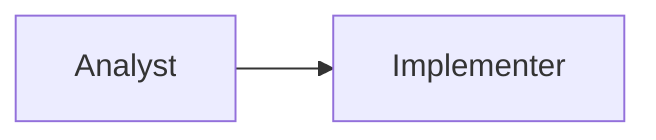

Instead

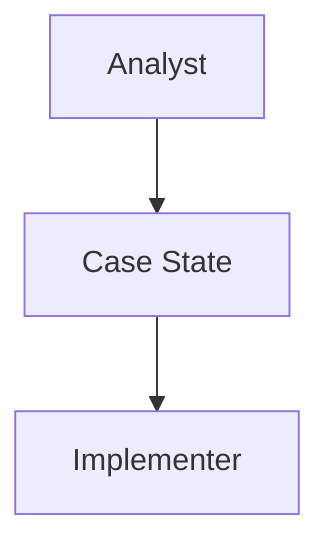

This guarantees reproducibility and complete audit history.

---

### AP-3

Agents own responsibilities—not data.

An agent owns the responsibility for creating or modifying specific artifacts, but all artifacts are stored in the Case State.

---

### AP-4

Every agent invocation is deterministic with respect to:

* Case State snapshot
* Assigned task
* External resources explicitly declared

Hidden conversational memory is prohibited.

---

# 3. Agent Overview

Debugging Engine defines seven architectural agents.

| Agent             | Primary Responsibility                  |
| ----------------- | --------------------------------------- |
| Analyst           | Construct technical explanations        |
| Adversary         | Challenge technical explanations        |
| Implementer       | Materialize experiments                 |
| Verifier          | Execute verification specifications     |
| Judge             | Orchestrate investigations              |
| Knowledge Service | Retrieve validated historical knowledge |
| Human             | Supply external expertise when required |

No additional architectural agents are defined in Debugging Engine v1.0.0.

---

# 4. Analyst

## Purpose

The Analyst transforms uncertainty into structured technical explanations.

The Analyst answers:

> "What could explain this unknown?"

The Analyst never attempts to prove its own hypotheses.

That responsibility belongs to experimentation.

---

## Responsibilities

The Analyst MUST:

* Analyze investigation state.
* Identify Unknowns requiring explanation.
* Construct hypotheses.
* Refine hypotheses.
* Design experiments.
* Produce technical interpretations of evidence.
* Estimate expected information gain for proposed experiments.
* Declare assumptions explicitly.

---

## Forbidden Responsibilities

The Analyst MUST NOT:

* Execute experiments.
* Modify source code.
* Collect evidence.
* Accept or reject hypotheses.
* Schedule work.
* Decide investigation completion.
* Ignore competing interpretations.

---

## Inputs

* Case State
* Assigned Unknown
* Retrieved Knowledge
* Previous Evidence
* Existing Hypotheses

---

## Outputs

The Analyst may create:

* Hypothesis
* Experiment Proposal
* Technical Interpretation
* Assumption
* Investigation Note

Nothing else.

---

# 5. Adversary

## Purpose

The Adversary exists to maximize epistemic robustness.

Its objective is not disagreement.

Its objective is preventing premature convergence.

---

## Responsibilities

The Adversary MUST:

* Challenge unsupported reasoning.
* Produce alternative hypotheses.
* Identify missing evidence.
* Detect hidden assumptions.
* Submit competing interpretations.
* Recommend experiments that discriminate competing explanations.

---

## Objection Categories

Every objection MUST belong to one of the following categories.

```text
Missing Evidence

Alternative Hypothesis

Invalid Assumption

Incomplete Explanation

Unsupported Causal Link

Experiment Design Flaw
```

Free-form criticism is prohibited.

---

## Forbidden Responsibilities

The Adversary MUST NOT:

* Reject investigations.
* Schedule experiments.
* Modify hypotheses directly.
* Execute experiments.
* Interpret architecture policy.

---

# 6. Implementer

## Purpose

The Implementer converts approved experiments into executable artifacts.

It transforms investigation intent into implementation.

---

## Responsibilities

The Implementer MUST:

* Modify code.
* Generate instrumentation.
* Configure experiments.
* Produce patches.
* Build experiment environments.
* Declare implementation assumptions.
* Report implementation failures.

---

## Forbidden Responsibilities

The Implementer MUST NOT:

* Design experiments.
* Change investigation priorities.
* Accept hypotheses.
* Evaluate evidence.
* Skip verification.

---

## Outputs

* Code Patch
* Configuration
* Instrumentation
* Build Artifact
* Failure Report

---

# 7. Verifier

## Purpose

The Verifier performs objective execution.

It never decides what should be measured.

It executes an externally supplied Verification Specification.

---

## Verification Specification

Every verification request MUST contain:

```yaml
metrics:
  - latency
  - throughput

required_logs:
  - redis
  - api

thresholds:
  latency:
    max: 20ms

comparison:
  previous_benchmark

expected_observations:
  - latency decreases
```

The Verifier MUST NOT invent any of these fields.

---

## Responsibilities

The Verifier MUST:

* Execute experiments.
* Collect observations.
* Run benchmarks.
* Execute test suites.
* Capture logs.
* Produce structured evidence.
* Report execution failures.

---

## Forbidden Responsibilities

The Verifier MUST NOT:

* Interpret observations.
* Promote hypotheses.
* Reject hypotheses.
* Design metrics.
* Change thresholds.

---

# 8. Judge

## Purpose

The Judge orchestrates the investigation.

The Judge is **meta-technical**.

It reasons about investigation structure rather than software systems.

---

## Responsibilities

The Judge MUST:

* Schedule experiments.
* Allocate resources.
* Prioritize investigation work.
* Track investigation progress.
* Detect scheduling conflicts.
* Manage experiment dependencies.
* Trigger replanning.
* Evaluate completion criteria.
* Manage escalation.
* Maintain investigation lifecycle.

---

## The Judge Does NOT Debug Software

The Judge MUST NOT:

* Analyze source code.
* Diagnose failures.
* Infer root causes.
* Evaluate architecture quality.
* Decide technical correctness.
* Produce hypotheses.

Those belong exclusively to the Analyst and Adversary.

---

## Judge Inputs

The Judge evaluates:

* Experiment cost
* Information gain estimates
* Resource availability
* Dependency graph
* Investigation lifecycle
* Safety constraints
* Human policies

The Judge never evaluates technical correctness.

---

# 9. Knowledge Service

## Purpose

The Knowledge Service retrieves previously validated investigations.

It does not generate knowledge.

It retrieves knowledge.

Knowledge generation is defined in Part V.

---

## Responsibilities

The Knowledge Service MUST:

* Retrieve similar investigations.
* Retrieve reusable experiments.
* Retrieve validated interpretations.
* Retrieve architectural patterns.

---

## Forbidden Responsibilities

It MUST NOT:

* Generate hypotheses.
* Modify investigation state.
* Rank hypotheses.
* Learn automatically.

---

# 10. Human

The Human is an architectural participant.

Not an exception.

Humans contribute information unavailable to autonomous agents.

Examples

* undocumented requirements
* compliance policy
* business rules
* production approvals

Human interactions become explicit Case State events.

---

# 11. Communication Model

All interaction occurs through Case State.

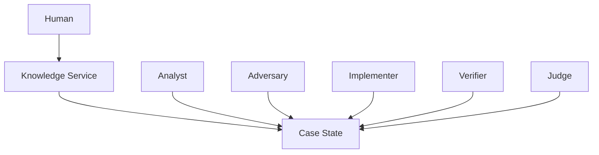

No direct agent-to-agent communication exists.

---

# 12. Agent Contracts

Every agent invocation follows the same contract.

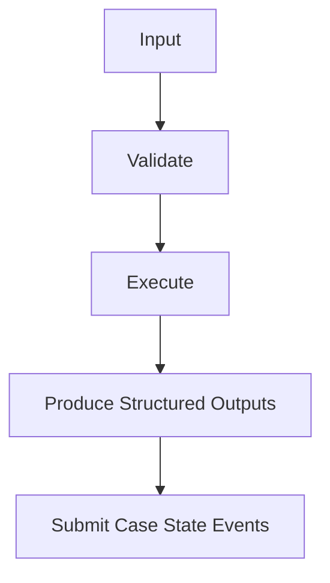

Agents never mutate arbitrary state.

They submit events.

The Case State applies validated state transitions.

---

# 13. Failure Behavior

Every agent failure produces a structured failure event.

Examples:

* `AgentExecutionFailed`
* `ExperimentImplementationFailed`
* `VerificationFailed`
* `KnowledgeRetrievalFailed`
* `HumanResponseTimeout`

Failures are investigation events, not exceptions hidden inside prompts.

---

# 14. Architectural Consequences

This architecture produces several important properties:

* Every responsibility has a single owner.
* Every investigation is auditable.
* Every decision is reproducible.
* Agent replacement becomes straightforward because contracts are explicit.
* New implementations (different LLMs, tools, or frameworks) can substitute for an agent without changing the overall architecture, provided they satisfy the same contract.
* The Judge remains impartial by coordinating investigations rather than participating in technical reasoning.

---

---

<a id="part-iii--investigation-model"></a>

# Debugging Engine v1.0.0

# Part III — Investigation Model

> **Status:** Normative
>
> This chapter defines the canonical investigation state. Every investigation object, lifecycle, relationship, and event is specified here. No later chapter may introduce new first-class investigation objects without updating this chapter.

---

# 1. Overview

Every Debugging Engine investigation is represented as a **Case State**.

The Case State is the authoritative representation of everything the system knows about an investigation at a given point in time.

It is not a conversation history.

It is not a prompt.

It is not agent memory.

It is a structured, versioned, event-derived state machine.

Every agent reads from it.

Every agent writes to it indirectly through domain events.

---

# 2. Case State

The Case State is the single source of truth for *current* investigation state.

It contains only current state.

Historical changes are preserved separately through the Event Log.

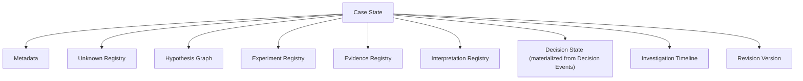

The Case State MUST be reconstructible by replaying the Event Log.

Therefore

**Event Log = Source of Truth**

Case State = Materialized View

This distinction is extremely important.

Unlike v3.0, the Case State is **not** the primary persistence model.

It is a projection.

Architectural decisions (for example accepting a root cause or escalating an investigation) are recorded as **Decision Events** in the Event Log. Current decision status is materialized into Case State Decision State. Decisions are not first-class investigative objects.

---

# 3. Event Log

Every mutation is recorded as an immutable event.

Examples

```
CaseCreated

UnknownDiscovered

HypothesisProposed

ExperimentApproved

ExperimentStarted

ExperimentCompleted

EvidenceRecorded

InterpretationSubmitted

InterpretationResolved

RootCauseAccepted

InvestigationEscalated
```

Events are immutable.

Nothing edits history.

---

# 4. Investigation Objects

Debugging Engine defines exactly five canonical first-class investigation objects, plus the Case that contains them.

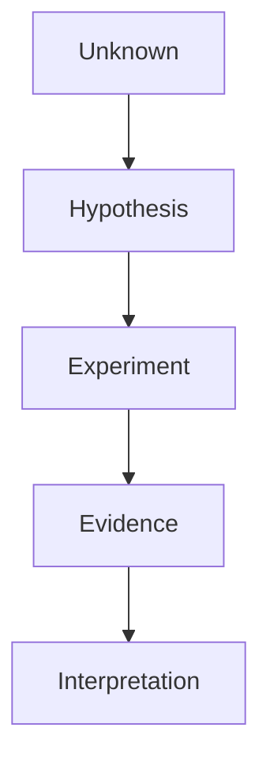

Architectural conclusions are represented as **Decision Events** (for example `RootCauseAccepted`, `InvestigationEscalated`, `InvestigationClosed`) recorded in the Event Log, with current decision status materialized in Case State.

Everything else is supporting infrastructure.

---

# 5. Unknown

## Definition

An Unknown represents a question whose answer is currently insufficiently supported.

Unknowns define investigation scope.

Examples

```
Why is request latency increasing?

Why does the service restart?

Why does memory usage never decrease?
```

Unknowns are never assumptions.

Unknowns are not hypotheses.

They are questions.

---

### Unknown Lifecycle

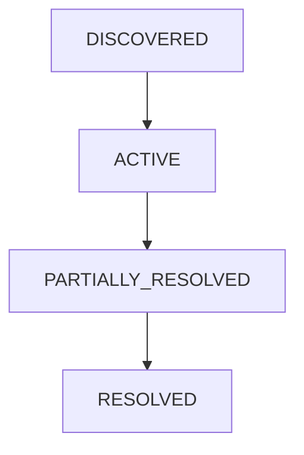

or

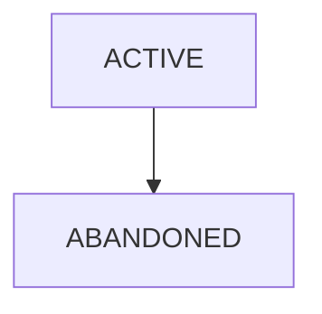

---

### Unknown Schema

```
Unknown

id

title

description

priority

status

created_at

resolved_at

related_components

parent_unknown

child_unknowns
```

---

# 6. Hypothesis

A Hypothesis proposes a technical explanation for one Unknown.

Every Hypothesis MUST reference exactly one target Unknown.

Multiple hypotheses may explain the same Unknown.

---

Example

Unknown

```
Why is latency increasing?
```

Hypothesis A

```
Redis lock contention
```

Hypothesis B

```
Database connection pool exhaustion
```

Hypothesis C

```
GC pauses
```

All coexist.

Debugging Engine never assumes exclusivity.

---

## Hypothesis Lifecycle

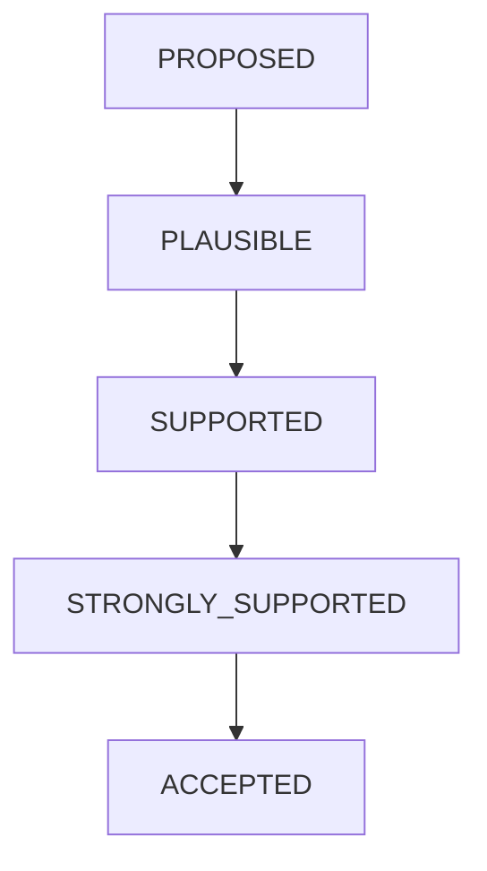

Negative evidence

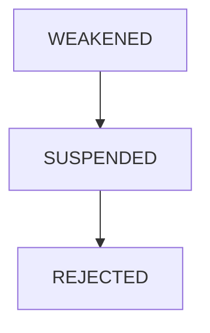

Notice

No numerical confidence exists.

---

### Promotion Rules

A hypothesis advances only through evidence.

Reasoning alone never promotes a hypothesis.

Example

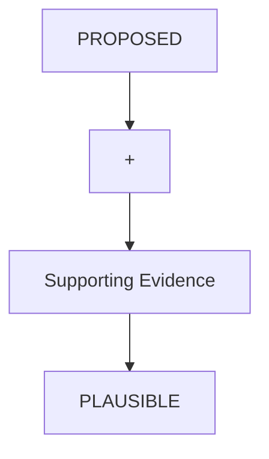

Repeated unsupported reasoning changes nothing.

---

# 7. Experiment

Experiments exist to reduce uncertainty.

Not to prove hypotheses.

Each experiment MUST declare

* target Unknown
* expected observations
* competing hypotheses affected
* estimated information gain
* estimated execution cost

Estimated information gain is a qualitative planning heuristic. Its levels and use in scheduling are defined in Part IV. It is not a probability and not numerical confidence.

---

## Experiment Types

Debugging Engine recognizes two categories.

### Observational

No system modification.

Examples

```
Enable logging

Collect traces

Capture metrics

Observe production traffic
```

---

### Intervention

Changes system behavior.

Examples

```
Modify implementation

Disable cache

Inject fault

Change configuration

Increase timeout
```

These require implementation.

---

## Experiment Lifecycle

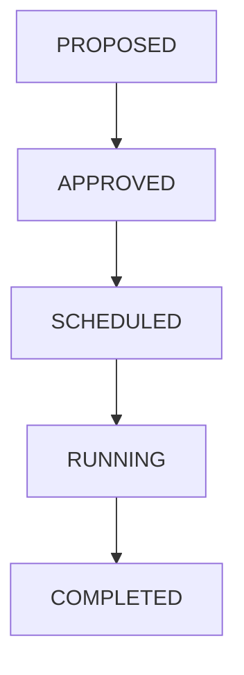

Alternative

```
FAILED

CANCELLED

EXPIRED
```

---

# 8. Evidence

Evidence is an immutable observation produced by experiment execution.

Evidence never explains.

Evidence only reports.

Example

```
Average latency

142 ms
```

Not

```
Redis caused latency.
```

That is interpretation.

---

### Evidence Categories

```
Benchmark

Log

Trace

Test Result

Metric

Profile

Stack Trace

Human Observation
```

Categories describe provenance.

Not importance.

---

### Evidence Attributes

Every Evidence object records

* source reliability
* collection method
* timestamp
* reproducibility
* related experiment

Importance is not stored.

Importance belongs to interpretation.

---

# 9. Interpretation

Interpretations connect evidence to hypotheses.

Multiple interpretations may exist simultaneously.

Example

Evidence

```
Redis latency increased.
```

Analyst

```
Supports Redis lock contention.
```

Adversary

```
Database retries indirectly caused Redis saturation.
```

Both are stored.

Nothing is discarded.

---

## Interpretation Outcome

Interpretations classify evidence as

```
SUPPORTS

WEAKENS

INCONCLUSIVE
```

INCONCLUSIVE does not affect hypothesis state.

Instead it motivates further experiments.

---

# 10. Decision Events

Architectural conclusions are **Decision Events**, not first-class investigation objects.

Examples

```
ExperimentApproved

HypothesisSuspended

RootCauseAccepted

InvestigationEscalated

InvestigationClosed
```

Every decision event MUST reference

* supporting evidence
* competing interpretations considered
* decision rationale
* responsible authority

Decision events are immutable.

If a conclusion changes, a new Decision Event is appended and Case State Decision State is updated. History is never rewritten.

---

# 11. Hypothesis Graph

Hypotheses form a directed acyclic graph.

Edges represent explanatory refinement.

Example

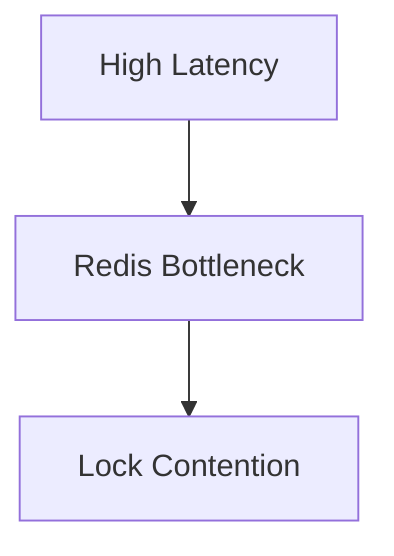

The graph represents reasoning.

Not scheduling.

---

# 12. Experiment Dependency Graph

This is a new first-class concept in v1.0.0.

Unlike the Hypothesis Graph,

this graph models execution.

Edges represent

* shared resources
* ordering constraints
* interference risks
* mutual exclusion

Example

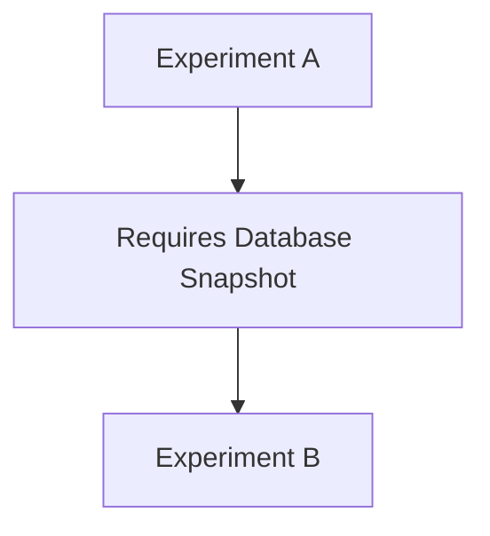

or

```
Experiment A

×

Experiment B

Conflict

Verbose logging
```

The Judge schedules using this graph.

Not the Hypothesis Graph.

---

# 13. Interpretation Resolution

Interpretations are not automatically merged.

Instead they enter arbitration.

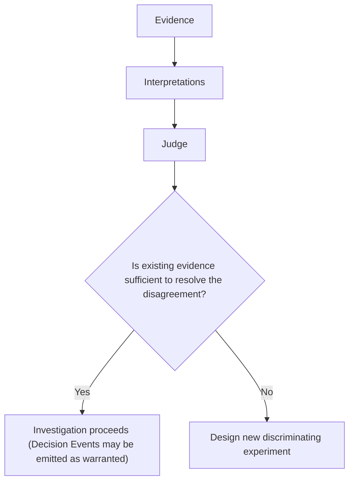

This is a critical innovation.

Disagreement produces experiments,

not debate.

The Judge MUST NOT decide which interpretation is technically correct. Technical correctness remains with evidence. The Judge determines only whether current evidence is sufficient to proceed or whether additional experimentation is required.

---

# 14. Root Cause Acceptance

A root cause may be accepted only if all conditions hold.

1.

Every relevant Unknown is resolved.

2.

Every required verification succeeds.

3.

No unresolved critical objection remains.

4.

Competing hypotheses are

* rejected

or

* suspended

or

lack supporting evidence.

5.

Evidence sufficiently explains observed behavior.

Acceptance is therefore rule-driven.

Not subjective.

Acceptance is recorded by emitting a `RootCauseAccepted` Decision Event.

---

# 15. Case Query API

Agents never receive the complete Case State.

Instead they request views.

Example

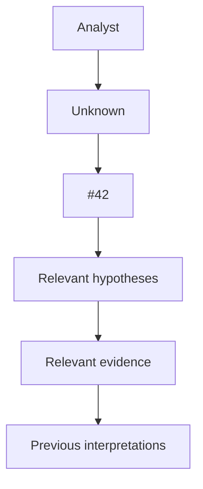

The Case State exposes projections,

not snapshots.

This solves scalability.

---

# 16. Revision Model

Every investigation object is versioned.

Objects are immutable.

Updates create new revisions.

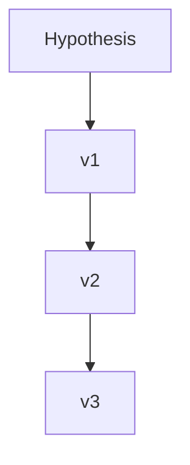

References always point to the latest accepted revision unless historical inspection is requested.

---

# 17. Architectural Consequences

The investigation model now has several important properties:

* The Event Log is the source of truth; the Case State is a projection.
* Unknowns, not hypotheses, define investigative scope.
* Evidence remains immutable while interpretations evolve.
* Multiple competing interpretations are preserved until resolved.
* The Hypothesis Graph models reasoning, while the Experiment Dependency Graph models execution.
* Architectural decisions are Decision Events with materialized Decision State, not peer investigative objects.
* Every state change is event-driven and reproducible.
* Large investigations scale through queryable projections rather than distributing the full Case State.

These properties collectively transform the Case State from a passive data structure into an **epistemic model** of the investigation itself.

---

---

<a id="part-iv--event-driven-investigation-orchestrator"></a>

# Debugging Engine v1.0.0

# Part IV — Event-Driven Investigation Orchestrator

> **Status:** Normative
>
> This chapter defines how investigations evolve over time. Unlike traditional debugging workflows, Debugging Engine is not iteration-driven or prompt-driven. It is an event-driven orchestration system in which investigation state changes only in response to explicit domain events.

---

# 1. Purpose

The Investigation Orchestrator governs the progression of an investigation.

It answers questions such as:

* What should happen next?
* Which experiments may execute?
* Which experiments must wait?
* Has uncertainty been reduced?
* Has progress stalled?
* Should investigation continue?
* Should a human be involved?

It never answers:

* What is the bug?
* Which hypothesis is technically correct?
* Which implementation is best?

Those remain the responsibility of technical agents and empirical evidence.

---

# 2. Event-Driven Execution

Unlike conventional multi-agent loops,

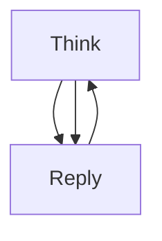

Debugging Engine executes through domain events.

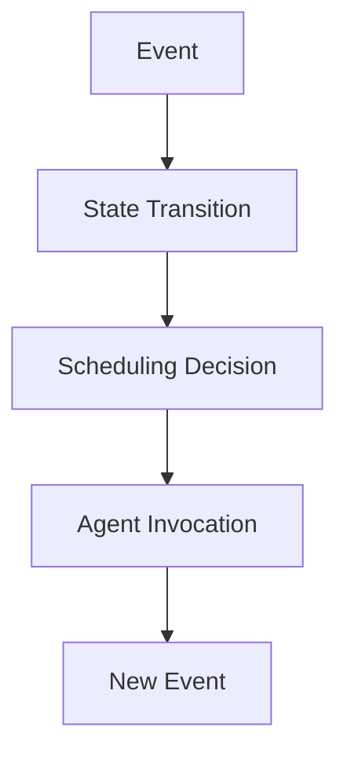

No agent "takes turns."

The orchestrator reacts whenever the investigation state changes.

---

# 3. Event Categories

Every event belongs to one of six categories.

### Investigation Events

Control the lifecycle of the investigation.

Examples:

* CaseCreated
* InvestigationActivated
* InvestigationEscalated
* InvestigationResolved
* InvestigationAbandoned

---

### Discovery Events

Expand the problem space.

Examples:

* UnknownDiscovered
* UnknownResolved
* UnknownReopened

---

### Hypothesis Events

Modify the explanatory model.

Examples:

* HypothesisProposed
* HypothesisPromoted
* HypothesisWeakened
* HypothesisSuspended
* HypothesisRejected

---

### Experiment Events

Represent experiment lifecycle.

Examples:

* ExperimentApproved
* ExperimentScheduled
* ExperimentStarted
* ExperimentCompleted
* ExperimentCancelled
* ExperimentExpired

---

### Evidence Events

Represent new observations.

Examples:

* EvidenceRecorded
* InterpretationSubmitted
* InterpretationWithdrawn

Notice there is intentionally **no** `InterpretationAccepted` event.

Interpretations are not accepted.

Evidence accumulates until a decision can be justified.

---

### Decision Events

Architectural decisions are represented as immutable events.

Examples:

* RootCauseAccepted
* InvestigationEscalated
* InvestigationClosed

The current investigation state is a projection of these events.

---

# 4. Orchestration Cycle

The orchestrator follows a simple invariant.

Every event produces exactly three phases.

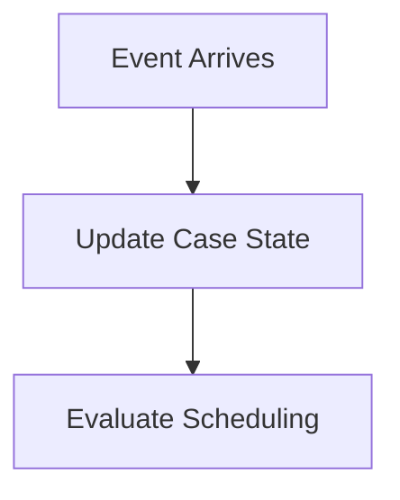

Nothing else.

The orchestrator never reasons directly.

---

# 5. Scheduling Philosophy

Scheduling is an optimization problem, not a debugging problem.

The Judge optimizes:

* expected uncertainty reduction,
* resource consumption,
* execution safety,
* dependency constraints,
* investigation progress.

The Judge never evaluates technical correctness.

---

# 6. Information Gain

Earlier versions attempted numerical confidence.

Debugging Engine v1.0.0 replaces this with qualitative Information Gain.

Information Gain estimates how much uncertainty an experiment could remove.

It is not a probability.

It is not confidence.

It is a planning heuristic supplied by the Analyst.

The Analyst classifies proposed experiments into four categories.

| Level   | Meaning                                                                   |
| ------- | ------------------------------------------------------------------------- |
| HIGH    | Could eliminate multiple competing hypotheses or resolve a major Unknown. |
| MEDIUM  | Clarifies one important uncertainty.                                      |
| LOW     | Provides incremental clarification.                                       |
| MINIMAL | Unlikely to materially affect the investigation.                          |

The Judge compares experiments only within these qualitative categories.

No arithmetic is performed.

---

# 7. Experiment Cost

Similarly, execution cost is qualitative.

| Level    | Examples                                                              |
| -------- | --------------------------------------------------------------------- |
| LOW      | Read logs, execute unit tests, inspect metrics.                       |
| MEDIUM   | Build branch, deploy staging, run integration tests.                  |
| HIGH     | Production benchmark, long-running load test, distributed deployment. |
| CRITICAL | Risky production intervention or high operational cost.               |

Cost is supplied by the Analyst and constrained by organizational policy.

---

# 8. Scheduling Matrix

Scheduling combines Information Gain and Cost.

For example:

| Information Gain | Cost     | Typical Action                        |
| ---------------- | -------- | ------------------------------------- |
| HIGH             | LOW      | Execute immediately.                  |
| HIGH             | MEDIUM   | Schedule if dependencies permit.      |
| MEDIUM           | LOW      | Execute when resources are available. |
| LOW              | HIGH     | Defer unless investigation stalls.    |
| MINIMAL          | CRITICAL | Normally reject.                      |

This is a policy framework, not a scoring algorithm.

Organizations MAY customize these policies.

---

# 9. Experiment Dependency Graph

The orchestrator schedules against the Experiment Dependency Graph rather than the Hypothesis Graph.

Dependencies are represented explicitly.

### Ordering dependency

```mermaid
flowchart TD
  Capturebaselinemetrics["Capture baseline metrics"]
  Modifycacheconfiguration["Modify cache configuration"]
  Capturebaselinemetrics --> Modifycacheconfiguration
```

Baseline must complete first.

---

### Resource dependency

```mermaid
flowchart TD
  ExperimentA["Experiment A"]
  Usesstagingcluster["Uses staging cluster"]
  ExperimentA --> Usesstagingcluster
```

Experiment B requiring the same exclusive resource must wait.

---

### Interference dependency

```text
Enable verbose logging

×

Latency benchmark
```

Running both simultaneously invalidates results.

They cannot execute concurrently.

---

# 10. Parallel Execution

Experiments MAY execute concurrently only when:

* resource dependencies are satisfied,
* interference constraints are absent,
* ordering constraints are satisfied,
* organizational policy permits.

Parallelism is therefore explicit rather than opportunistic.

> **Package note (informative):** `debugging-engine` 1.0.x implements **serial** Judge scheduling only (one Task / approve / verify path at a time). Concurrent experiment orchestration from this section is not available in the published kernel yet.

---

# 11. Long-Running Experiments

Some investigations require prolonged observation.

Examples:

* memory leaks,
* race conditions,
* intermittent production failures,
* distributed consensus issues.

These experiments remain in the `RUNNING` state until completion criteria are met.

While they execute, the orchestrator MAY continue scheduling unrelated work.

The investigation never blocks on a single experiment.

---

# 12. Arbitration

Competing interpretations are expected.

The orchestrator does **not** determine which interpretation is correct.

Instead it asks a different question:

> **Can the current evidence resolve this disagreement?**

If yes:

* the investigation proceeds.

If no:

* the orchestrator requests new discriminating experiments from the Analyst.

Evidence—not authority—resolves technical disagreements.

---

# 13. Replanning

Every new event may trigger replanning.

Examples:

* an experiment failed unexpectedly,
* evidence weakens the leading hypothesis,
* a new Unknown is discovered,
* a dependency is removed,
* resources become available.

The orchestrator continuously adapts the investigation plan.

There is no concept of a fixed investigation sequence.

---

# 14. Starvation Policy

Investigations must never become permanently idle.

If all executable experiments are deferred because of low information gain or excessive cost, the orchestrator enters a recovery phase.

Possible actions include:

1. Request new experiment proposals from the Analyst.
2. Ask the Adversary to identify overlooked alternatives.
3. Request additional human information.
4. Escalate if no meaningful progress is possible.

Waiting indefinitely is prohibited.

---

# 15. Human Escalation

Escalation is an explicit architectural state.

The orchestrator MUST escalate when any of the following conditions hold:

* No executable experiment can further reduce uncertainty.
* Investigation progress has stalled over a configurable number of scheduling cycles.
* Required information depends on external domain expertise.
* Safety or policy constraints prohibit remaining experiments.
* Critical disagreement cannot be resolved empirically.

Escalation is considered a successful completion of autonomous investigation.

---

# 16. Completion Criteria

An investigation may transition to `RESOLVED` only when all conditions are satisfied:

1. All priority Unknowns are resolved.
2. Verification succeeds.
3. No unresolved critical objections remain.
4. Remaining hypotheses are rejected, suspended, or unsupported.
5. A `RootCauseAccepted` decision event is emitted.
6. Required organizational approval has been obtained (if applicable).

Resolution is therefore a state transition governed by explicit criteria rather than a conversational conclusion.

---

# 17. Architectural Properties

The Event-Driven Investigation Orchestrator provides the following guarantees:

* **Responsiveness:** Any meaningful event may immediately trigger replanning.
* **Concurrency:** Independent experiments proceed without blocking unrelated work.
* **Determinism:** State transitions are driven by explicit events rather than hidden reasoning.
* **Safety:** Dependencies and interference are represented explicitly before scheduling.
* **Auditability:** Every orchestration decision is reconstructible from the Event Log.
* **Scalability:** The orchestrator manages investigations of varying complexity without relying on synchronous reasoning loops.

The orchestrator therefore acts less like a conversational coordinator and more like an operating system scheduler for epistemic work: allocating resources, enforcing constraints, reacting to events, and advancing investigations without participating in technical reasoning itself.

---

---

<a id="part-v--execution-verification--learning"></a>

# Debugging Engine v1.0.0

# Part V — Execution, Verification & Learning

> **Status:** Normative
>
> This chapter defines how approved experiments are executed, how evidence is produced, how investigations communicate through events, and how validated investigations become reusable organizational knowledge.

---

# 1. Purpose

An investigation has value only if it produces reproducible evidence.

Reasoning proposes experiments.

Execution performs them.

Verification records observations.

Learning preserves validated knowledge.

This chapter defines that execution pipeline.

---

# 2. Execution Architecture

Execution is intentionally separated from orchestration.

```mermaid
flowchart TD
  Analyst[Analyst]
  Proposal[Experiment Proposal]
  Approval[Judge Approval]
  Pipeline[Execution Pipeline]
  Verifier[Verifier]
  Evidence[Evidence]
  EventBus[Event Bus]
  Orchestrator[Investigation Orchestrator]
  Analyst --> Proposal --> Approval --> Pipeline --> Verifier --> Evidence --> EventBus --> Orchestrator
```

Notice that neither the Analyst nor the Judge executes experiments.

---

# 3. Event Bus

The Event Bus is infrastructure.

It is **not** an architectural agent.

Its sole responsibility is reliable delivery of domain events.

Examples

```
ExperimentStarted

ExperimentCompleted

EvidenceRecorded

VerificationFailed

HumanResponseReceived

KnowledgeValidated
```

Every execution component publishes events.

The Investigation Orchestrator subscribes to those events.

---

## Requirements

The Event Bus MUST

* preserve event ordering within an investigation
* guarantee at-least-once delivery
* support asynchronous execution
* allow replay from durable storage

It MUST NOT

* interpret events
* modify Case State
* perform scheduling

---

# 4. Execution Pipeline

Every approved experiment follows the same lifecycle.

```mermaid
flowchart TD
  ExperimentApproved[ExperimentApproved]
  Implementation[Implementation]
  Execution[Execution]
  Verification[Verification]
  Evidence[Evidence]
  EvidenceRecordedEvent["EvidenceRecorded Event"]
  ExperimentApproved --> Implementation
  Implementation --> Execution
  Execution --> Verification
  Verification --> Evidence
  Evidence --> EvidenceRecordedEvent
```

Every stage either succeeds or emits a failure event.

No silent failures exist.

---

# 5. Experiment Classes

Debugging Engine recognizes two execution pipelines.

---

## Observational Experiments

Observe the system without modifying behavior.

Examples

* Enable tracing
* Collect metrics
* Download logs
* Capture thread dumps
* Observe production traffic

Pipeline

```mermaid
flowchart TD
  ConfigureObservation["Configure Observation"]
  CollectData["Collect Data"]
  Normalize[Normalize]
  Evidence[Evidence]
  ConfigureObservation --> CollectData
  CollectData --> Normalize
  Normalize --> Evidence
```

---

## Intervention Experiments

Modify system behavior.

Examples

* Apply patch
* Disable cache
* Increase timeout
* Inject fault
* Deploy branch

Pipeline

```mermaid
flowchart TD
  Implement[Implement]
  Build[Build]
  Deploy[Deploy]
  Execute[Execute]
  Verify[Verify]
  Evidence[Evidence]
  Implement --> Build
  Build --> Deploy
  Deploy --> Execute
  Execute --> Verify
  Verify --> Evidence
```

Intervention experiments carry higher operational risk and SHOULD require stricter approval policies.

---

# 6. Verification Specification

The Verifier executes only against an explicit Verification Specification.

A specification defines

* metrics
* expected observations
* acceptance thresholds
* comparison baseline
* required artifacts

Example

```yaml
metrics:
  - latency
  - throughput
  - error_rate

baseline:
  production

expected:
  latency:
    direction: decrease

thresholds:
  latency:
    max: 20ms

artifacts:
  - logs
  - traces
```

The Verifier MUST NOT infer missing requirements.

---

# 7. Evidence Production

Verification produces immutable Evidence objects.

Evidence records

* observation
* timestamp
* provenance
* reproducibility
* collection method
* associated experiment

Evidence never contains explanations.

---

# 8. Evidence Quality

Not all evidence has equal strength.

Instead of numerical confidence, Debugging Engine evaluates evidence along qualitative dimensions.

| Attribute       | Description                                        |
| --------------- | -------------------------------------------------- |
| Reliability     | Was the evidence collected correctly?              |
| Relevance       | Does it directly address the Unknown?              |
| Reproducibility | Can the observation be repeated?                   |
| Completeness    | Does it sufficiently characterize the observation? |
| Independence    | Is it corroborated by unrelated sources?           |

These attributes guide interpretation.

They never become probabilities.

---

# 9. Verification Failure

Verification failures are informative.

Examples

* build failed
* deployment failed
* benchmark invalid
* required logs missing
* timeout exceeded

Each failure produces structured events.

Example

```
VerificationFailed

reason:
MissingRequiredMetric
```

The investigation may continue despite verification failures.

---

# 10. Learning Pipeline

Not every completed investigation becomes organizational knowledge.

Knowledge must be validated.

Pipeline

```mermaid
flowchart TD
  CompletedInvestigation["Completed Investigation"]
  CandidateKnowledge["Candidate Knowledge"]
  AdversaryReview["Adversary Review"]
  KnowledgeValidation["Knowledge Validation"]
  KnowledgeRepository["Knowledge Repository"]
  CompletedInvestigation --> CandidateKnowledge
  CandidateKnowledge --> AdversaryReview
  AdversaryReview --> KnowledgeValidation
  KnowledgeValidation --> KnowledgeRepository
```

This prevents accidental learning from incorrect conclusions.

---

# 11. Knowledge Validation

Knowledge is accepted only if

* investigation completed successfully
* verification succeeded
* root cause accepted
* no unresolved objections remain
* evidence is reproducible
* organizational policy permits publication

Knowledge is therefore curated rather than accumulated.

---

# 12. Case Fingerprints

Knowledge retrieval does not rely solely on semantic similarity.

Every completed investigation generates a fingerprint.

Fingerprint dimensions include

```
Affected Components

Technology Stack

Error Signatures

Failure Mode

Observed Symptoms

Performance Metrics

Environment

Root Cause Category

Verification Pattern
```

Fingerprints support efficient retrieval across large knowledge repositories.

---

# 13. Knowledge Retrieval

When a new investigation begins, the Knowledge Service MAY retrieve similar validated investigations.

Retrieval SHOULD prioritize

1. Matching failure signatures.
2. Similar architectural components.
3. Similar verification patterns.
4. Similar environmental conditions.

Retrieved knowledge is advisory.

It never automatically creates hypotheses.

---

# 14. Knowledge Aging

Knowledge can become obsolete.

The repository SHOULD support

* versioning
* deprecation
* supersession
* expiration

Deprecated knowledge remains historically available but SHOULD NOT influence new investigations unless explicitly requested.

---

# 15. Organizational Memory

Debugging Engine distinguishes between three classes of knowledge.

| Type                  | Purpose                                                    |
| --------------------- | ---------------------------------------------------------- |
| Investigation Records | Complete event history of a specific case                  |
| Validated Knowledge   | Reusable engineering knowledge derived from investigations |
| Reference Patterns    | Organizational best practices and architectural guidance   |

This separation prevents historical investigations from being mistaken for universally applicable rules.

---

# 16. Learning Governance

Organizations SHOULD establish governance policies covering

* publication approval
* confidential information removal
* compliance review
* retention periods
* access control

The architecture intentionally separates technical validation from organizational governance.

---

# 17. Architectural Properties

The execution and learning architecture provides:

* **Asynchronous execution** through the Event Bus.
* **Deterministic evidence production** via Verification Specifications.
* **Immutable observations** separated from interpretations.
* **Curated organizational learning** through explicit validation.
* **Scalable knowledge retrieval** using investigation fingerprints.
* **Long-term maintainability** through knowledge versioning and aging.

Execution therefore becomes an auditable, reproducible process rather than an ad hoc collection of scripts and prompts.

---

---

<a id="part-vi--formal-specification"></a>

# Debugging Engine v1.0.0

# Part VI — Formal Specification

> **Status:** Normative
>
> This chapter defines the canonical schemas, contracts, protocols, state machines, validation rules, and extension interfaces of Debugging Engine. Any implementation claiming Debugging Engine compliance MUST satisfy the requirements in this chapter.

---

# 1. Scope

Part VI defines:

* Canonical object schemas
* Event envelope
* Domain events
* Agent contracts
* State transition rules
* Validation rules
* Query interfaces
* Extension points
* Error model

Implementation technologies are intentionally unspecified.

---

# 2. Schema Versioning

Every serialized object MUST contain:

```json
{
  "schema_version": "1.0.0"
}
```

Backward-compatible additions MUST increment the minor version.

Breaking changes MUST increment the major version.

Consumers MUST reject unsupported major versions.

---

# 3. Canonical Event Envelope

All domain events MUST use the same envelope.

```json
{
  "event_id": "uuid",
  "case_id": "uuid",
  "event_type": "HypothesisProposed",
  "timestamp": "2026-07-29T12:34:56Z",
  "producer": "Analyst",
  "schema_version": "1.0.0",
  "correlation_id": "uuid",
  "causation_id": "uuid",
  "payload": { }
}
```

---

## Field Definitions

| Field          | Description                                    |
| -------------- | ---------------------------------------------- |
| event_id       | Globally unique identifier                     |
| case_id        | Investigation identifier                       |
| event_type     | Canonical event type                           |
| producer       | Producing architectural component              |
| correlation_id | Links events belonging to the same workflow    |
| causation_id   | References the event that triggered this event |
| payload        | Event-specific data                            |

---

# 4. Canonical Investigation Objects

The following objects are normative.

```text
Case

Unknown

Hypothesis

Experiment

Evidence

Interpretation
```

Every implementation MUST support all six.

No implementation may redefine their meaning.

---

# 5. State Machines

Every object has an explicit lifecycle.

Example

Unknown

```mermaid
flowchart TD
  DISCOVERED[DISCOVERED]
  ACTIVE[ACTIVE]
  PARTIALLYRESOLVED[PARTIALLY_RESOLVED]
  RESOLVED[RESOLVED]
  DISCOVERED --> ACTIVE
  ACTIVE --> PARTIALLYRESOLVED
  PARTIALLYRESOLVED --> RESOLVED
```

Experiment

```mermaid
flowchart TD
  PROPOSED[PROPOSED]
  APPROVED[APPROVED]
  SCHEDULED[SCHEDULED]
  RUNNING[RUNNING]
  COMPLETED[COMPLETED]
  PROPOSED --> APPROVED
  APPROVED --> SCHEDULED
  SCHEDULED --> RUNNING
  RUNNING --> COMPLETED
```

Hypothesis

```mermaid
flowchart TD
  PROPOSED[PROPOSED]
  PLAUSIBLE[PLAUSIBLE]
  SUPPORTED[SUPPORTED]
  STRONGLYSUPPORTED[STRONGLY_SUPPORTED]
  ACCEPTED[ACCEPTED]
  PROPOSED --> PLAUSIBLE
  PLAUSIBLE --> SUPPORTED
  SUPPORTED --> STRONGLYSUPPORTED
  STRONGLYSUPPORTED --> ACCEPTED
```

Negative transitions

```mermaid
flowchart TD
  WEAKENED[WEAKENED]
  SUSPENDED[SUSPENDED]
  REJECTED[REJECTED]
  WEAKENED --> SUSPENDED
  SUSPENDED --> REJECTED
```

Transitions not defined by this specification are invalid.

---

# 6. Validation Rules

Every event MUST pass validation before mutating Case State.

Examples

HypothesisProposed

Requires

* target Unknown exists
* title not empty
* explanation provided

ExperimentApproved

Requires

* experiment exists
* dependency validation succeeds
* approval authority present

EvidenceRecorded

Requires

* experiment completed
* provenance defined
* timestamp present

Validation failure produces a new event.

It never silently modifies state.

---

# 7. Domain Events

Debugging Engine defines a fixed vocabulary of domain events.

### Investigation

```text
CaseCreated
InvestigationActivated
InvestigationResolved
InvestigationEscalated
InvestigationAbandoned
```

---

### Unknown

```text
UnknownDiscovered
UnknownResolved
UnknownReopened
```

---

### Hypothesis

```text
HypothesisProposed
HypothesisPromoted
HypothesisWeakened
HypothesisSuspended
HypothesisRejected
```

---

### Experiment

```text
ExperimentApproved
ExperimentScheduled
ExperimentStarted
ExperimentCompleted
ExperimentCancelled
ExperimentExpired
```

---

### Evidence

```text
EvidenceRecorded
InterpretationSubmitted
InterpretationWithdrawn
```

---

### Decisions

```text
RootCauseAccepted
InvestigationClosed
```

No implementation may invent new core event types without extending the specification.

---

# 8. Agent Contract

Every architectural agent implements the same logical interface.

```typescript
interface Agent {

    read(Query)

    execute(Task)

    emit(DomainEvent[])
}
```

Agents never write Case State directly.

Only events modify investigation state.

---

# 9. Query Interface

Agents retrieve projections.

Never entire Case State.

Example

```mermaid
flowchart TD
  Query[Query]
  Projection[Projection]
  Agent[Agent]
  Query --> Projection
  Projection --> Agent
```

Typical queries

```text
Unknown #17

Open Experiments

Evidence for Hypothesis X

Unresolved Interpretations

Pending Dependencies
```

---

# 10. Case State Projection

Case State is materialized from Event Log.

```mermaid
flowchart TD
  EventLog["Event Log"]
  ProjectionEngine["Projection Engine"]
  CaseState["Case State"]
  EventLog --> ProjectionEngine
  ProjectionEngine --> CaseState
```

Projection implementations MAY vary.

Observable behavior MUST NOT.

---

# 11. Event Bus Contract

The Event Bus MUST provide

* durable delivery
* ordering per Case
* replay
* subscriptions
* acknowledgements

The Event Bus MUST NOT

* interpret payloads
* mutate Case State
* perform scheduling

---

# 12. Error Model

Errors are represented as domain events.

Example

```text
ValidationFailed

VerificationFailed

ImplementationFailed

KnowledgeRetrievalFailed

HumanTimeout
```

Errors are first-class investigation artifacts.

Not exceptions.

---

# 13. Extension Points

Debugging Engine intentionally separates architecture from implementation.

The following interfaces are replaceable.

---

## Language Model Provider

Examples

* OpenAI
* Anthropic
* Ollama
* Local models

Architecture remains identical.

---

## Knowledge Store

Examples

* PostgreSQL
* Neo4j
* Qdrant
* Elasticsearch

---

## Event Bus

Examples

* Kafka
* RabbitMQ
* Azure Service Bus
* NATS
* Redis Streams

---

## Verification Platform

Examples

* GitHub Actions
* Jenkins
* Azure Pipelines
* Local execution

---

## Observability

Examples

* OpenTelemetry
* Grafana
* New Relic
* Datadog

---

# 14. Compliance Levels

To encourage adoption, Debugging Engine defines three compliance tiers.

### Level 1 — Core Compliance

Requirements:

* Canonical investigation objects
* Event Log
* Case State projection
* Agent contracts
* Domain events

Suitable for research prototypes and educational implementations.

---

### Level 2 — Operational Compliance

Adds:

* Event Bus
* Dependency graph
* Parallel execution
* Verification specifications
* Human escalation

Suitable for production deployments.

---

### Level 3 — Full Compliance

Adds:

* Knowledge validation
* Fingerprint retrieval
* Governance
* Schema versioning
* Extension interfaces
* Complete auditability

Represents full Debugging Engine v1.0.0 conformance.

---

# 15. Security Considerations

Implementations SHOULD support:

* authentication
* authorization
* immutable audit logs
* encrypted event transport
* access-controlled knowledge repositories
* sensitive data redaction
* investigation isolation between tenants

Security policies are implementation-specific but MUST preserve the architectural invariants.

---

# 16. Interoperability

Two implementations are interoperable if they:

* understand canonical events,
* honor state transition rules,
* implement required object schemas,
* preserve event ordering,
* expose equivalent query semantics.

Implementation language is irrelevant.

---

# 17. Reference Implementation Requirements

A conforming reference implementation MUST demonstrate:

* Event sourcing with Case State projection.
* Event-driven orchestration.
* The seven architectural agents.
* Immutable evidence.
* Query-based Case State access.
* Parallel experiment scheduling with dependency enforcement.
* Verification Specifications.
* Knowledge validation before persistence.
* Replay of historical investigations from the Event Log.

These capabilities serve as executable proof that the specification is complete and internally consistent.

---

---

<a id="part-vii--reference-architecture--implementation-guide"></a>

# Debugging Engine v1.0.0

# Part VII — Reference Architecture & Implementation Guide

> **Status:** Informative
>
> This chapter is not part of the normative specification. It presents one possible reference architecture demonstrating how the concepts defined in Parts I–VI can be realized in practice. Implementations MAY differ provided they remain compliant with the normative requirements.

---

# 1. Objectives

The reference implementation has four goals.

1. Demonstrate that the specification is implementable.
2. Provide a baseline architecture for future implementations.
3. Validate that the specification contains no missing concepts.
4. Serve as a testbed for future versions of Debugging Engine.

It is **not** intended to be the only implementation.

---

# 2. High-Level Architecture

```mermaid
flowchart TB
  UI[Client UI]
  API[Investigation API]
  EventStore[Event Store]
  Projection[Projection Engine]
  EventBus[Event Bus]
  CaseState[Case State Store]
  Orchestrator[Investigation Orchestrator]
  Knowledge[Knowledge Service]
  Analyst[Analyst]
  Adversary[Adversary]
  Implementer[Implementer]
  Verifier[Verifier]

  UI --> API
  API --> EventStore
  API --> Projection
  EventStore --> EventBus
  Projection --> CaseState
  EventBus --> Orchestrator
  CaseState --> Knowledge
  Orchestrator --> Analyst
  Orchestrator --> Adversary
  Orchestrator --> Implementer
  Orchestrator --> Verifier
```

Every component communicates through events and Case State projections.

No agent communicates directly with another agent.

---

# 3. Recommended Repository Layout

```text
debugging-engine/

├── specification/
│   ├── part1-philosophy.md
│   ├── part2-agents.md
│   ├── part3-model.md
│   ├── part4-orchestrator.md
│   ├── part5-learning.md
│   ├── part6-formal.md
│   └── part7-reference.md
│
├── schemas/
│   ├── case.schema.json
│   ├── unknown.schema.json
│   ├── hypothesis.schema.json
│   ├── experiment.schema.json
│   ├── evidence.schema.json
│   └── interpretation.schema.json
│
├── contracts/
│
├── orchestrator/
│
├── agents/
│
├── event-store/
│
├── projections/
│
├── knowledge/
│
├── examples/
│
└── tests/
```

The repository organization mirrors the conceptual architecture.

> **Note:** This repository (`debugging-engine`) publishes the official specification as [`docs/SPECIFICATION.md`](SPECIFICATION.md). The layout above remains an informative reference for implementations that prefer a different tree.

---

# 4. Suggested Service Boundaries

A production deployment may separate responsibilities into independent services.

| Service            | Responsibility                                               |
| ------------------ | ------------------------------------------------------------ |
| Investigation API  | External interface                                           |
| Event Store        | Persistent event log                                         |
| Projection Service | Materialized Case State                                      |
| Orchestrator       | Scheduling and lifecycle management                          |
| Agent Runtime      | Executes Analyst, Adversary, Implementer, and Verifier tasks |
| Knowledge Service  | Retrieval and validation                                     |
| UI                 | Visualization and interaction                                |

Service decomposition is optional.

Logical responsibilities remain fixed.

---

# 5. Persistence Model

The reference implementation uses Event Sourcing.

```mermaid
flowchart TD
  DomainEvent["Domain Event"]
  AppendEventStore["Append Event Store"]
  Projection[Projection]
  CaseState["Case State"]
  DomainEvent --> AppendEventStore
  AppendEventStore --> Projection
  Projection --> CaseState
```

Case State may be regenerated entirely by replaying events.

This enables:

* complete auditability,
* historical reconstruction,
* debugging of investigations,
* projection evolution.

---

# 6. Example Investigation

Suppose an engineer reports:

> "API latency increased after yesterday's deployment."

### Step 1 – Create Investigation

```
CaseCreated
UnknownDiscovered
```

Unknown:

```
Why did API latency increase?
```

---

### Step 2 – Analyst

Produces hypotheses.

```
Redis contention

Database connection exhaustion

GC pauses
```

Events

```
HypothesisProposed

HypothesisProposed

HypothesisProposed
```

---

### Step 3 – Adversary

Challenges assumptions.

Example

```
Deployment changed logging configuration.

Verbose logging may explain latency.
```

Event

```
HypothesisProposed
```

---

### Step 4 – Judge

Schedules experiments.

```mermaid
flowchart TD
  Collectlatencymetrics["Collect latency metrics"]
  CollectRedismetrics["Collect Redis metrics"]
  ProfileGC["Profile GC"]
  Collectlatencymetrics --> CollectRedismetrics
  CollectRedismetrics --> ProfileGC
```

---

### Step 5 – Implementer

Adds instrumentation.

```
Tracing enabled
```

---

### Step 6 – Verifier

Runs benchmark.

Produces evidence.

```
Redis latency

142 ms
```

EvidenceRecorded

---

### Step 7 – Analyst

Interprets evidence.

```
Supports Redis contention.
```

---

### Step 8 – Adversary

Provides competing interpretation.

```
Database retry storm indirectly caused Redis contention.
```

---

### Step 9 – Judge

Determines existing evidence cannot resolve the disagreement.

Requests a new discriminating experiment.

---

### Step 10 – New Experiment

Disable retry policy.

Observe Redis latency.

---

### Step 11 – Verification

Evidence

```
Redis latency returns to normal.
```

---

### Step 12 – Root Cause

```mermaid
flowchart TD
  Databaseretrystorm["Database retry storm"]
  Rediscontention["Redis contention"]
  Highlatency["High latency"]
  Databaseretrystorm --> Rediscontention
  Rediscontention --> Highlatency
```

Event

```
RootCauseAccepted
```

---

### Step 13 – Learning

Validated investigation enters Knowledge Repository.

Future investigations retrieve it using fingerprints.

---

# 7. Visualization

A practical implementation SHOULD provide visualizations for:

* Unknown hierarchy
* Hypothesis graph
* Experiment dependency graph
* Timeline of events
* Evidence registry
* Investigation lifecycle
* Knowledge lineage

Visualization is not required for compliance but greatly improves usability.

---

# 8. Performance Considerations

The architecture is designed to scale through:

* event sourcing,
* asynchronous processing,
* query projections,
* parallel experiment execution,
* independent agent runtimes.

Large investigations SHOULD avoid distributing the complete Case State to every agent. Query-based projections remain the preferred mechanism.

---

# 9. Testing Strategy

A conforming implementation should test at multiple levels.

### Unit Tests

* Domain object validation
* State transition rules
* Event validation

### Integration Tests

* Projection correctness
* Event ordering
* Agent contract compliance

### End-to-End Tests

* Complete investigation replay
* Parallel experiment scheduling
* Human escalation flow
* Knowledge validation pipeline

Replay testing is particularly important because it verifies that the Event Log alone is sufficient to reconstruct the investigation.

---

# 10. Evolution Strategy

Debugging Engine is intended to evolve without breaking existing investigations.

Recommended approach:

* Add new event types only through versioned extensions.
* Preserve backward compatibility for object schemas where possible.
* Introduce new projections rather than modifying historical events.
* Record Architecture Decision Records (ADRs) for any change affecting the normative specification.

This allows long-lived investigation histories to remain valid across versions.

---

# 11. Known Limitations

Debugging Engine intentionally leaves several areas open for future work.

* Multi-case investigations that share evidence.
* Distributed orchestration across multiple organizations.
* Formal reasoning about probabilistic systems.
* Automated generation of verification specifications.
* Adaptive scheduling heuristics based on historical outcomes.
* Formal verification of orchestration policies.

These topics are outside the scope of v1.0.0.

---

# 12. Future Roadmap

A possible evolution path is:

* **v1.1** — Pluggable scheduling policies and richer experiment planning.
* **v1.2** — Cross-investigation reasoning and federated knowledge repositories.
* **v2.0** — Multi-case orchestration, collaborative investigations, and formally verified orchestration semantics.

The philosophy established in Part I should remain stable even as these capabilities expand.

---

# Appendix A — Terminology

The specification concludes with a canonical glossary defining every architectural term—Case State, Unknown, Hypothesis, Experiment, Evidence, Interpretation, Event, Projection, Orchestrator, Information Gain, Verification Specification, Fingerprint, and related concepts. Each term has a single normative definition to eliminate ambiguity across implementations.

---

# Appendix B — Architecture Decision Records (ADRs)

All future changes to the normative specification should be documented as ADRs. Each ADR records:

* Context
* Decision
* Rationale
* Consequences
* Alternatives Considered

This provides a transparent governance process for evolving Debugging Engine while preserving backward compatibility.

---
